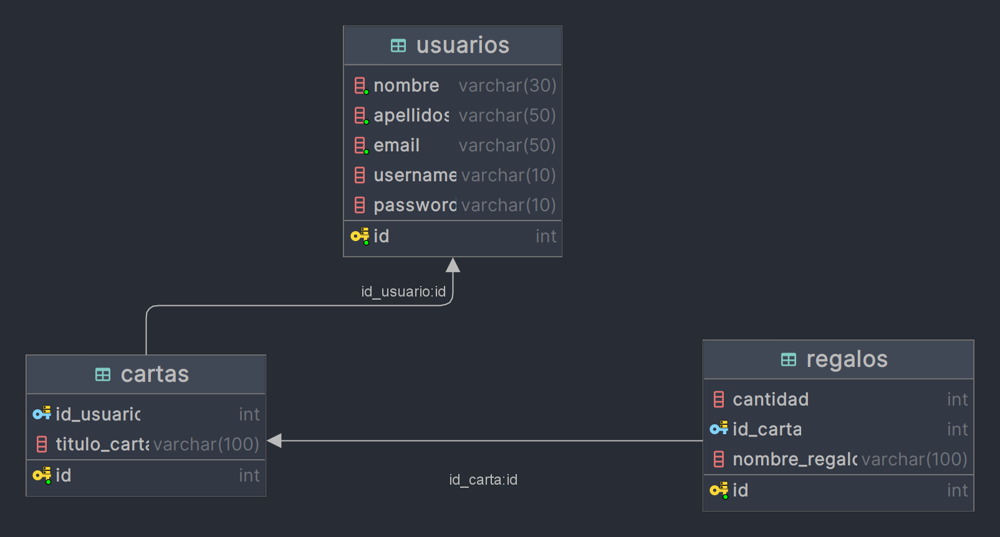

# Tecnologías utilizadas

- HTML5, CSS3 y Bootstrap para el diseño de la página web.
- Servlets para la gestión de las peticiones HTTP.
- MySQL para la persistencia de los datos.
- Maven para la gestión del proyecto.
- Tomcat para el despliegue de la aplicación web.

# Requisitos previos

- Tener instalado un servidor MySQL.
- Tener instalado un servidor Tomcat.
- Conservar el POM.xml original del proyecto.
- En el servidor de MYSQL ejecutar el comando `source src/main/webapp/WEB-INF/conf/tw.sql` o copiar y pegar el contenido del fichero `src/main/webapp/WEB-INF/conf/tw.sql` en la consola de MySQL para crear el usuario, la base de datos y las tablas necesarias.
- Por motivos de seguridad en el fichero `src/main/resources/config.properties` se encuentra las credenciales del administrador.

  - USERNAME=`admin`
  - PASSWORD=`admin`.
  - Si se desea cambiar las credenciales, se debe modificar el fichero `src/main/resources/config.properties` y poner las credenciales deseadas siempre y cuando dichas credenciales existan en la base de datos.
- Modelo relacional de la base de datos:

# Despliegue

[Página de inicio](http://localhost:8080/webapp-sesion7/)

# Bibliografía

- [Bootstrap](https://getbootstrap.com/)
- [Documentación de la asignatura](https://campusvirtual.unex.es/zonauex/avuex/course/view.php?id=16957#section-4)
- [ChatGPT](https://chatgpt.com/)

# Github

[Repositorio](https://github.com/Jloen1999/sesion7TW)
